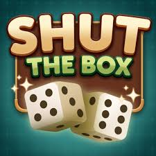
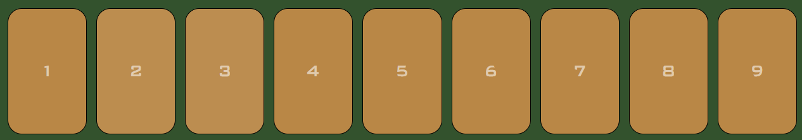

# 🎲🎲 **Shut the Box** 🎲🎲

A digital version of the classic dice game Shut the Box with a slight tweak. Roll the dices, combine numbers, and try to shut all the tiles before you run out of moves.

## 💡 Background & Motivation

_Shut the Box_ is a classic dice game traditionally played as a tabletop game. It combines simple rules with strategic decision-making, making it both accessible and engaging.

I chose to recreate this game digitally to explore how game logic can be implemented in a browser environment. This project allowed me to practice handling user interactions, managing game state, and implementing validation logic for possible moves.

Additionally, I introduced a slight variation to the traditional rules, adding more flexibility in tile selection to make the gameplay more dynamic and interesting.

## 🕹️ How It Works

- You start with tiles, numbered 1 through 9 open. 
- Roll both dice.
- Select tiles that match either:
  - The value of individual dice, or
  - The total of both dice
- You can select up to 2 tiles per turn.
- Selected tiles are “shut” (removed from play).
- The game ends when:
  - All tiles are shut (you win 🎉), or
  - No valid moves remain (game over)
- The final score is based on the sum of remaining tiles.
- 👉 Lower score = better result

## 🧠 Game Rules

- Example: If you roll 4 and 5 (total = 9), you can:
  - Close 4, 5, or both, or
  - Close 9
- Each number can only be used once per game.

## 🎮 Multiplayer mode

- Play a turn-based 1 vs 1 match using separate boards
- Player 1 completes their round first, followed by Player 2
- Scores are compared after both turns end
- Lowest score wins
- Same score = draw

## 🛠 Tech Stack

- HTML
- CSS
- JavaScript

## ✨ Features

- Interactive number selection
- Dice rolling logic
- Move validation
- Win / lose detection
- Clean and simple UI

## 🚀 How to Run

1. Download or clone the repository
2. Open `index.html` in your browser

## 🔥 Future Improvements

- Add player names
- Scoreboard tracking multiple rounds
- Vs AI bot
- Timer for each round
